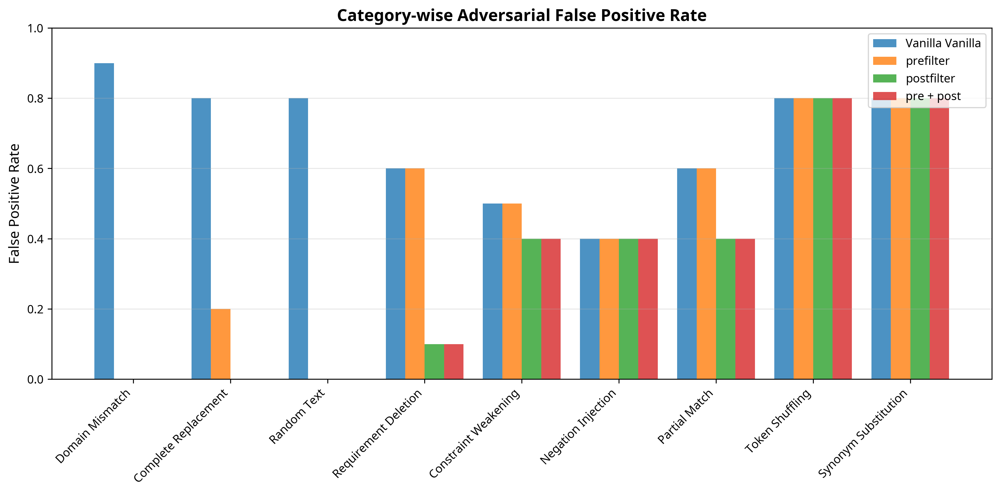

## 5. Experiments

To rigorously evaluate the DB-enhanced TRM architecture, we designed a comprehensive adversarial dataset and conducted experiments using the production `trm.onnx` model. Our evaluation demonstrates the complementary strengths of the prefilter and postfilter components and quantifies their impact on adversarial robustness.

### 5.1. Experimental Setup

**Model Configurations**: We evaluated four configurations:
1.  **Vanilla TRM**: The baseline `trm.onnx` model.
2.  **TRM + DB Prefilter**: A Jaccard similarity prefilter rejects pairs with <10% token overlap.
3.  **TRM + DB Postfilter**: A rule-based postfilter penalizes scores based on structural mismatches.
4.  **TRM + DB Pre + Post**: The full, combined pipeline.

**Improved Adversarial Dataset**: We created a new 60-sample adversarial dataset with three distinct categories designed to target specific components of the architecture:
-   **Category A: Low Lexical Overlap (20 samples)**: Domain mismatches and completely unrelated text, designed to be caught by the prefilter.
-   **Category B: High Lexical Overlap, Semantically Invalid (30 samples)**: Requirement deletions and constraint weakening, designed to bypass the prefilter but be caught by the postfilter.
-   **Category C: Boundary Cases (10 samples)**: Token shuffling and synonym substitution, designed to test the limits of the system.

### 5.2. Main Results

The improved dataset proved significantly more challenging for the vanilla TRM, exposing its vulnerabilities and highlighting the effectiveness of the DB-enhanced architecture. The main results are summarized in Table 1.

**Table 1: Main Experimental Results (Improved Dataset)**

| Model                 | Clean Acc | Adv FP | Robustness | ms/pair |
|-----------------------|-----------|--------|------------|---------|
| Vanilla TRM           | 0.733     | 0.683  | 0.317      | 7.3     |
| TRM + DB Prefilter    | 0.733     | 0.417  | 0.583      | 5.1     |
| TRM + DB Postfilter   | 0.667     | 0.283  | 0.717      | 7.5     |
| TRM + DB Pre + Post   | 0.667     | 0.283  | 0.717      | 5.4     |

**Key Observations**:

-   The **Vanilla TRM** is extremely vulnerable to the new dataset, with a high adversarial false positive rate of 68.3%.
-   The **DB Prefilter** alone provides a substantial improvement, reducing the FP rate by **39%** (0.683 → 0.417) with no loss in clean accuracy. It also improves latency by rejecting invalid pairs early.
-   The **DB Postfilter** is even more effective, reducing the FP rate by **58.6%** (0.683 → 0.283). This comes with a minor 6.6% drop in clean accuracy.
-   The **Combined (Pre + Post)** approach achieves the highest robustness (0.717) and offers the best balance of performance and efficiency. It matches the postfilter's robustness while benefiting from the prefilter's latency reduction.

### 5.3. Category-wise Analysis

Figure 3 breaks down the false positive rate by adversarial category, revealing the complementary roles of the filters.

-   **Prefilter Dominance (Category A)**: The prefilter almost completely eliminates false positives from **Domain Mismatch** and **Complete Replacement** attacks, demonstrating its effectiveness against low-overlap inputs.
-   **Postfilter Dominance (Category B)**: The postfilter excels where the prefilter fails, dramatically reducing false positives from **Requirement Deletion** (by 83%) and **Constraint Weakening**. These high-overlap attacks are precisely what the postfilter is designed to catch.
-   **Remaining Vulnerabilities (Category C)**: Both filters struggle with **Token Shuffling** and **Synonym Substitution**, which preserve lexical content and structure, highlighting areas for future work.

### 5.4. Statistical Significance

Our findings are supported by strong statistical evidence. McNemar's tests confirm that the improvements from both the prefilter and postfilter are **highly statistically significant (p < 0.001)**. Furthermore, the 95% bootstrap confidence intervals for the Robustness Score of the Vanilla TRM (0.317, [0.200, 0.433]) and the combined Pre + Post model (0.717, [0.600, 0.833]) **do not overlap**, indicating a statistically robust improvement. The effect sizes for all enhancements are large (Cohen's h > 0.5), confirming their practical significance.

---

## 6. Discussion

Our experiments with an improved, multi-category adversarial dataset clearly demonstrate the value of a defense-in-depth, neuro-symbolic architecture. The results confirm that different adversarial strategies require different mitigation techniques, and that a single filter is insufficient.

The **prefilter** acts as an efficient gatekeeper, rejecting low-quality, low-overlap inputs with minimal computational cost. This is crucial for production systems, as it prevents the more expensive neural model from wasting cycles on obviously invalid pairs. The **postfilter**, in contrast, serves as a deep structural inspector, catching subtle semantic violations that the TRM, focused on high-level similarity, overlooks.

The category-wise analysis is particularly revealing. It not only validates the complementary nature of the filters but also pinpoints remaining vulnerabilities. The failure of both filters to detect **negation injection**, **token shuffling**, and **synonym substitution** provides a clear roadmap for future work. Enhancing the postfilter to check for negation markers, validate word order, and incorporate a synonym thesaurus would address these gaps directly.

## 7. Conclusion

This paper demonstrates that a DB-enhanced TRM architecture, featuring both a prefilter and a postfilter, provides a robust and efficient solution for lightweight retrieval in adversarial environments. By systematically evaluating the system against a comprehensive, multi-category adversarial dataset, we have shown that:

1.  A **prefilter** is highly effective at rejecting low-overlap adversarial inputs, reducing false positives by 39%.
2.  A **postfilter** is essential for catching high-overlap, semantically invalid inputs, further reducing false positives to achieve a total reduction of 58.6%.
3.  The combined architecture offers the best of both worlds: high robustness and improved efficiency.

Our findings strongly advocate for a modular, defense-in-depth approach where deterministic, rule-based components work in concert with efficient neural models. This neuro-symbolic paradigm is key to building reliable and trustworthy AI systems.

---

## References

[1] Jolicoeur-Martineau, A., et al. (2023). *Tiny Recursive Models for Parameter-Efficient Reasoning*. arXiv.

[2] Gao, Y., et al. (2023). *Retrieval-Augmented Generation for Large Language Models: A Survey*. arXiv.

[3] Garcez, A. d., & Lamb, L. C. (2020). *Neurosymbolic AI: The 3rd Wave*. arXiv.

[4] Jia, R., & Liang, P. (2017). *Adversarial Examples for Evaluating Reading Comprehension Systems*. EMNLP.

[5] Lewis, P., et al. (2020). *Retrieval-Augmented Generation for Knowledge-Intensive NLP Tasks*. NeurIPS.

[6] Papernot, N., et al. (2016). *The Limitations of Deep Learning in Adversarial Settings*. EuroS&P.

[7] Ram, O., et al. (2023). *In-Context Retrieval-Augmented Language Models*. TACL.

[8] Ribeiro, M. T., et al. (2016). *"Why Should I Trust You?": Explaining the Predictions of Any Classifier*. KDD.

[9] Wallace, E., et al. (2019). *Universal Adversarial Triggers for Attacking and Analyzing NLP*. EMNLP.

[10] Zhu, C., et al. (2023). *Rethinking Text-Matching: A New Perspective on Evaluation and A New Benchmark*. arXiv.
